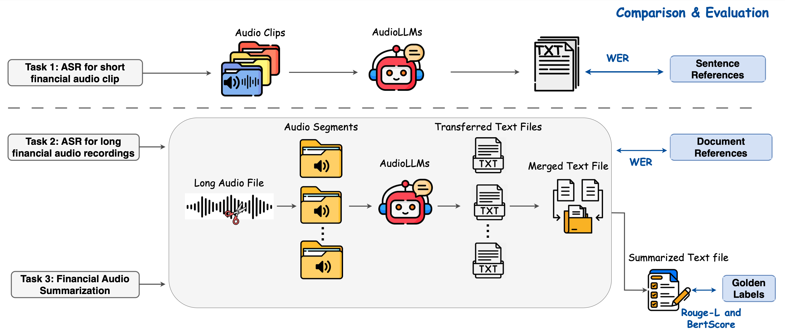

=============================
Task
=============================

Here we specify the FinAudio tasks, which are illustrated in below Figure.

ASR for short financial audio clip
=============================
Automatic Speech Recognition converts spoken language into text. Short audio clips from financial chatbot assistants or financial news often contain dense financial terms. This task evaluates AudioLLMs' accuracy in transcribing financial audio clips, directly impacting applications such as financial voice assistants.

In this task, each input is represented as :math:`(A, Q, R)`, where :math:`A` is an audio clip, :math:`Q` is the prompt instruction, and :math:`R` is the reference transcript. The transcribed text :math:`T` is generated as :math:`T = \textit{AudioLLM}(A, Q)`. The Word Error Rate (WER) is computed as :math:`\text{WER} = \frac{S + D + I}{N}`, where :math:`S`, :math:`D`, and :math:`I` represent the number of substitutions, deletions, and insertions, respectively, and :math:`N` is the total number of words in the reference (:math:`N = S + D + C`, with :math:`C` indicating correct words). A lower WER indicates better ASR performance.

ASR for long financial audio recordings
=============================
Long audio recordings are common in finance, capturing events like quarterly earnings calls, mergers and acquisitions discussions, and central bank meetings. In this scenario, ASR task is thus used to transcribe lengthy financial audio, evaluating AudioLLMs' capability to handle extended audio inputs. Challenges include long durations and complex financial terminology. This task assesses the models' ability to consistently maintain transcription accuracy over long recordings, which is essential for comprehensive financial analysis.

To handle the varying window lengths and the inability of current AudioLLMs to process long audio files within a single window, we standardize audio inputs to 30-second segments, dividing each raw audio :math:`A` into chunks :math:`\{a_1, a_2, \dots, a_n\}`. We transcribe each chunk :math:`a_i` using AudioLLMs into :math:`t_i`, and concatenated the resulting transcriptions as :math:`T = [t_1; t_2; \dots; t_n]`. The transcription quality is then evaluated by computing the WER.

Financial audio summarization
=============================
This task measures the ability of AudioLLMs to accurately summarize long financial audio content, a scenario unique to financial applications. It evaluates models' understanding of financial discussions, extraction of key points, and effectiveness in condensing lengthy audio into concise summaries. This capability is crucial for stakeholders needing quick insights from extensive financial dialogues, such as investor briefings or regulatory meetings.

AudioLLMs can process audio with a maximum length of 30 seconds. Therefore, AudioLLM cannot perform the summarization task independently, we developed a processing pipeline. Given input data represented as :math:`(A, Q, L)`, where :math:`A` denotes the long audio recording, :math:`Q` the prompt instruction, and :math:`L` the reference summary, the pipeline first segments the long audio into smaller chunks. Each chunk is transcribed by an AudioLLM into text segments :math:`t_i`, which are combined into a complete transcription :math:`T`. This transcription is then input into an LLM to generate the summary :math:`S`. Summarization performance is evaluated using two widely adopted summarization evaluation metrics: Rouge-L and BertScore, computed between the generated summary (:math:`S`) and the reference summary (:math:`L`).