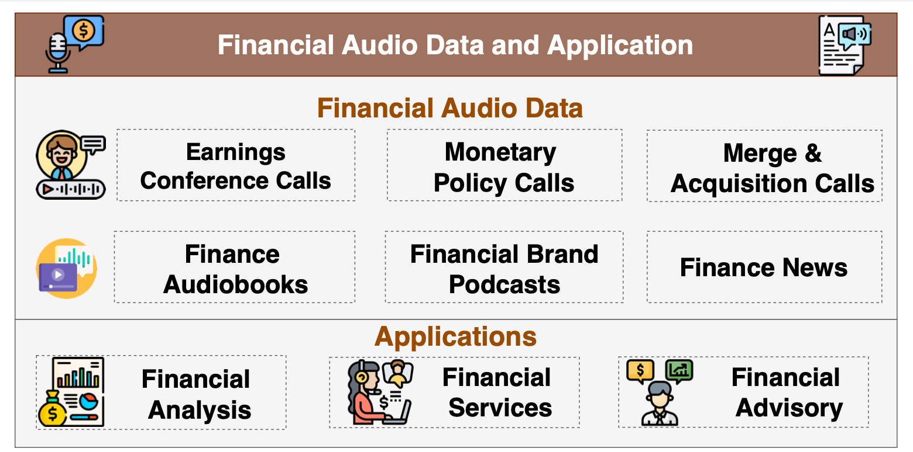

=============================
Overview
=============================

Audio data plays a critical role in the financial domain, encompassing earnings conference calls, investor presentations, and customer service interactions. Timely and accurate interpretation of financial audio data underpins financial
services, sentiment analysis, and investment decisions.

We introduce FinAudio, the first AudioLLM benchmark tailored for the financial domain. 